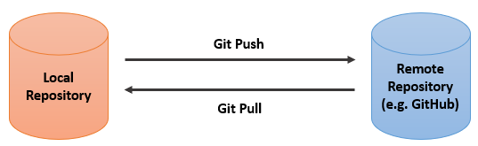

# Roteiro de Estudos sobre Git

## Objetivo
Esse roteiro tem como objetivo expor os conhecimentos estudados sobre Git, descrevendo o processo de alteração de arquivo e apresentando os comandos básicos utilizados para poder realizar esse processo.
## Tópicos

### 1. Introdução
- Git é um sistema de controle de versão que consegue rastrear as alterações feitas em arquivos, registrando o que foi feito e possibilitando reverter para versões específicas, caso necessário. O Git também possibilita a colaboração entre usuários, permitindo que as alterações feitas por eles sejam mescladas em uma única fonte. Tendo isso em mente, o roteiro irá 

### 2. Alteração de Arquivos


- Descrição do processo de envio de nova alterção
    
    1. Após realizar as modificações necessárias, é preciso recuperar a versão mais atualizada do documento, contento todas as alterações feitas por terceiros após a primeira vez que o arquivo foi baixado no repositório local.
        ```
        git pull origin <-nome main->
        ```
    2. Verificado que foi obtida a versão mais recente do arquivo, é necessário submeter um comando para adicionar todas as modificações realizadas. Essas modificações serão mescladas à versão mais recente.
        ```
        git add .
        ```
        É adicionado '.' no final do comando pois nesse caso, é desejado que todas as modificações que estão abaixo da __branch main__ sejam adicionadas ao arquivo atual.
    3. É aconselhável utilizar o comando __status__ para verificar se as modificações foram salvas no arquivo atual.
        ```
        git status
        ```
    4. Agora, pode ser dado o commit da solução, que sempre vem acompanhado de uma mensagem para que seja possível identificar o que foi modificado.
        ```
        git commit -m "mensagem do commit"
        ```
    5. Por fim, enviamos as mudanças para o repositório remoto através do comando __git push__
        ```
        git push
        ```
### 3. Comandos Básicos
- Git init : É utilizado para inicializar um repositório Git dentro de um diretório do sistema.
    ```
    git init
    ```
- Git clone : É utilizado para criar uma cópia de um repositório remoto em um diretório da máquina.
    ```
    git clone
    ```
- __Git status__ : É utilizado para verificar o status de um repositório git, bem como o estado do repositório central. O comando mostra informações sobre se o projeto local está sincronizado com o central, quais arquivos estão sendo monitorados pelo Git e em qual branch você está no projeto.
    ```
    git status
    ``` 
- __Git add__ : É utilizado para adicionar arquivos ao pacote de alterações a serem feitas. É possível adicionar um único arquivo, múltiplos arquivos de uma vez, como git add <-arquivo1-> <-arquivo2-> ..., ou até mesmo um diretório, a partir de seu caminho. Uma vez que um arquivo é adicionado ao pacote de alterações com o comando add, ele está pronto para entrar no próximo commit.
    ```
    git add <-arquivo->
    ``` 
- __Git commit__ : É utilizado para criar uma nova versão do projeto a partir de um pacote de alterações. O commit pega o pacote de modificações adicionado através do comando git add, fecha essas alterações num pacote e o identifica através de um Hashcode. Além disso, para cada commit é necessário escrever uma mensagem para identificá-lo, com uma mensagem clara de quais alterações foram feitas neste commit.
    ```
    git commit -m "mensagem do commit
    ``` 
- __Git pull : *É utilizado para buscar e baixar conteúdos de um repositório remoto e atualizar imediatamente o repositório local para corresponder a esse conteúdo.*__
    ```
    git pull
    ```
- __Git push : *É utilizado para fazer upload do conteúdo do repositório local para um repositório remoto.*__
    ```
    git push
    ```
- Git log : É utilizado para ver o histórico de alterações do projeto, onde aparecerão todos os commits feitos, com suas respectivas mensagens e códigos identificadores. O comando é muito útil quando precisamos rastrear o andamento de um projeto e verificar em qual ponto cada funcionalidade foi implementada. 
    ```
    git log
    ``` 
- __Git branch__ : É utilizado para criar novos ramos de desenvolvimento, bem como visualizar quais são os ramos existentes.
    ```
    git branch <-nome-da-branch->
    ``` 
- __Git checkout__ : É utilizado para navegar entre as versões do projeto, bem como entre as diferentes ramificações criadas. Para navegar entre as versões, basta usar o comando:
    ```
    git checkout <-Hashcode do commit->
    ```
    E todo o estado do projeto se modificará ao estado no qual o commit foi feito. Similarmente, para navegar entre as ramificações podemos usar o comando:
    ```
    git checkout <-nome da branch->
    ```
    E a branch será alterada. O comando também permite criar uma branch e imediatamente mudar para ela através do comando:
    ```
    git checkout -b <-nome da branch->
    ```
- Git diff : É utilizado para visualizar modificações feitas entre commits, sejam eles entre um commit arbitrário e o estado atual do projeto, dois commits arbitrários, ou até mesmo todas alterações entre dois commits distintos. Para visualizar as alterações entre um commit distinto e o atual, basta usar o comando:
    ```
    git diff <-Hashcode do commit anterior->
    ```
    E serão listadas todas as diferenças no projeto entre os dois commits.

### 4. Referências
- [O que é Git?](https://git-scm.com/book/en/v2/Getting-Started-What-is-Git%3F)
  
- [Comandos básicos de Git.](https://www.alura.com.br/artigos/o-que-e-git-github)

- [Git pull.](https://www.atlassian.com/git/tutorials/syncing/git-pull#:~:text=The%20git%20pull%20command%20is,Git%2Dbased%20collaboration%20work%20flows.)

- [Git push.](https://www.atlassian.com/git/tutorials/syncing/git-push#:~:text=The%20git%20push%20command%20is,repository%20to%20a%20remote%20repo.)